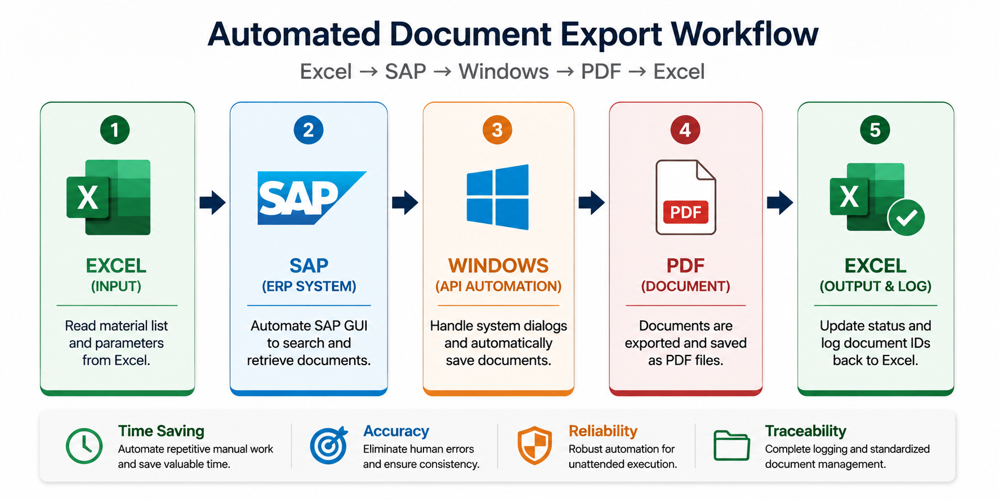

# Excel SAP Document Batch Export (VBA)

***For more information regarding the overview of this project, please refer to [Project Presentation](Resources/presentation-slides.pptx).***

This project is an **Excel VBA automation** that connects to **SAP GUI** and **batch‑exports document‑type PDFs** (e.g., inspection or quality documents) from SAP into a local folder, while updating status and document IDs back in Excel.

The macro reads a list of materials from an Excel column, opens the relevant SAP document view, double‑clicks rows to activate links, prints the document to a PDF printer, and uses Windows API calls (`FindWindow`, `SetForegroundWindow`) to automatically fill the “Save As PDF” dialog. This turns a **manual, repetitive SAP PDF‑export process** into a one‑click Excel macro.

---

## The Business Problem (The "Why")

In many enterprise supply chain, procurement, and operations environments, team members spend thousands of hours performing highly repetitive manual extraction tasks:
- Opening SAP GUI repeatedly to lookup individual document IDs (such as Purchase Orders, Invoices, or Material sheets).
- Manually navigating through complex grids and document menus.
- Overcoming standard security/printer prompts to manually print or "Save As" PDFs.
- Manually naming and filing PDFs into local storage.
- Manually updating an Excel log with the extraction status.

This manual process takes an estimated average of **3 to 5 minutes per document**, is highly prone to human typo errors, and introduces massive operational bottlenecks during high-volume audits or planning cycles.

---

## The Solution (The "How")

This project automates the entire end-to-end pipeline into a single, modular Excel-driven VBA engine. The user supplies the input parameters and executes the macro. The automation then performs the SAP navigation, document export, PDF naming, and Excel status updates without further user intervention. The automated workflow typically completes in **approximately 10–30 seconds per document** while requiring no further user intervention.

---

## Key Benefits & Business Metrics

### 1. Significant Time Savings: 
- Manual efforts - 3 minutes * 1000 PDFs = 50 hours
- Automated workflow — 30 seconds × 1000 PDFs = approximately 8.3 hours (unattended)

⚡ **In this case, it saves 83% of the time!**

### 2. No Human Error: 
- Eliminates manual typos in PDF naming, target paths, and status recording.

### 3. Standardized Archiving: 
- Dynamically generates folder directory trees based on structural variables (e.g., date, vendor, project code).

### 4. Non-Intrusive Integration: 
- Operates purely through local SAP GUI Scripting APIs without requiring back-end modification, API gateway access, or exposing corporate ERP keys.

---

## Key Features

- **Batch processing** of material numbers from an Excel worksheet, with column‑based status tracking.
- **SAP GUI Scripting** via Excel VBA to:
  - Enter material codes.
  - Navigate grids and tabs.
  - Print documents to a virtual PDF printer.
- **Windows API automation** of the “Save As PDF” dialog to type the path and press Enter.
- **Reusable, modular VBA**: Organized into independent modules to improve readability, maintainability, and reuse.

All sensitive internal strings (paths, SAP IDs, company terms) have been replaced with generic placeholders so this can be safely shared as a portfolio project.

---

## Workflow Overview

The diagram summarizes the complete automation pipeline. Excel provides the input data, SAP GUI retrieves the required documents, Windows API automation manages the operating system dialogs during PDF generation, the exported documents are archived using standardized naming, and the processing results are written back to Excel. This end-to-end workflow minimizes manual intervention while improving efficiency, consistency, and traceability.

This diagram is included as a conceptual portfolio visual. It communicates the structure of the solution without revealing real SAP data or internal company details, and it reflects the iterative approach used to refine the project.

***Conceptual workflow diagram created with assistance from ChatGPT AI.**



---

## Project Structure

Suggested module layout:

- `modMain_ExcelSAP_BatchPDF.bas`  
  - Main entry point and Excel‑loop logic.
- `modWinAPI_DialogHelpers.bas`  
  - Windows API helpers for dialog automation and PDF export.
- `modSAP_Helpers.bas`  
  - SAP session, grid navigation, print button handling.
- `modCore_Workflow.bas`  
  - Core workflow: `HandleMaterialWithoutFile`, text cleaning, status handling.
- `modOLE_Shield.bas`
  - Manages temporary Windows OLE message handling during long-running SAP GUI automation.

This separation keeps the code **clean, testable, and reusable**.

---

## Motivation

This project is used as part of my technical portfolio to demonstrate:
- Building **non‑trivial Excel VBA automations** for repetitive enterprise workflows.
- Understanding and scripting **SAP GUI processes** using `SAP GUI Scripting`.
- Automation patterns that connect **Excel ↔ SAP ↔ Windows dialog** flows.
- Designing **maintainable, modular automation solutions** for enterprise operational workflows.

---

## Requirements

- **Environment**
  - Windows with **SAP GUI** installed and **SAP GUI Scripting enabled** (server + client).
  - **Excel** (tested 64‑bit; uses `PtrSafe` declarations).
  - A **PDF‑capable printer** or virtual PDF printer (e.g., “Virtual PDF Printer”).

- **Excel Setup**
  - Create or open a **macro-enabled workbook** (`.xlsm`)..  
  - Import the five `.bas` modules and run `CreateFilesInGroupFolders_Document_Batch_PDF` from `modMain_ExcelSAP_BatchPDF`.  
  - Column `B` used for material numbers, column `C` for file status, column `D` for document ID.

- **SAP Setup**
  - SAP GUI Scripting must be enabled in SAP and in the user profile (registry or SAP options).  
  - Customize the SAP control IDs (`SAP_MATERIAL_FIELD_ID`, `SAP_GRID_ID`, etc.) to match your transaction of choice.

---

## Installation

1. Clone this repository:
   ```bash
   git clone https://github.com/seungtaemoon/Portfolio.git
   cd Portfolio/vba-sap-document-batch-export
   ```
2. Open your target Excel workbook and press `ALT + F11` to open the VBA editor.  
3. Import the five `.bas` files:
   - `File` → `Import File...` → select `modMain_ExcelSAP_BatchPDF.bas`, `modWinAPI_DialogHelpers.bas`, `modSAP_Helpers.bas`, `modCore_Workflow.bas`, and `modOLE_Shield.bas`.  
4. Save the workbook as a **macro‑enabled file** (`.xlsm`).  
5. Adjust constants in `modWinAPI_DialogHelpers` and `modSAP_Helpers` to match your environment (folder path, SAP element IDs, printer name, dialog captions).  
6. Run the macro:
   - `Developer` → `Macros` → select `CreateFilesInGroupFolders_Document_BatchPDF` or assign it to a button.

---

## Usage

1. Prepare an Excel sheet:
   - Column `B`: list of material numbers (or document keys).  
   - Column `C`: leave blank or `N` for rows to be processed.  
   - Column `D`: receives the document ID from SAP.
2. Ensure SAP GUI is open and logged in.  
3. Run `CreateFilesInGroupFolders_Document_BatchPDF`.  
4. Monitor the **Immediate Window** (`CTRL + G` in VBA) for debug messages.  
5. After completion:
   - Check that PDFs were created under the configured folder (e.g., `C:\Users\Developer\Documents\Document_Batch_Output\`).  
   - Check that columns `C` and `D` are updated with status and document IDs.

---

## Security and Disclosure Note

- All company‑specific strings (paths, transaction IDs, project names) have been **replaced with generic placeholders**.  
- This is a **portfolio‑oriented project** to demonstrate Excel VBA, SAP GUI Scripting, and Windows API automation, not production‑ready for enterprise use without review.  
- Always follow your organization’s policies for SAP GUI scripting and automation usage.

---

## License

MIT License (or another open‑source license of your choice).  
You can copy the standard MIT text and customize your name and year, or use a GitHub license selector during repo creation.

---

## Development Process

This project was developed using an AI-assisted engineering workflow.
AI tools accelerated brainstorming, documentation, and iterative refinement, while all system architecture, implementation, debugging, SAP integration, testing, and engineering decisions were performed by the author.

---

If you reuse or extend this project, please retain attribution in accordance with the selected license.
