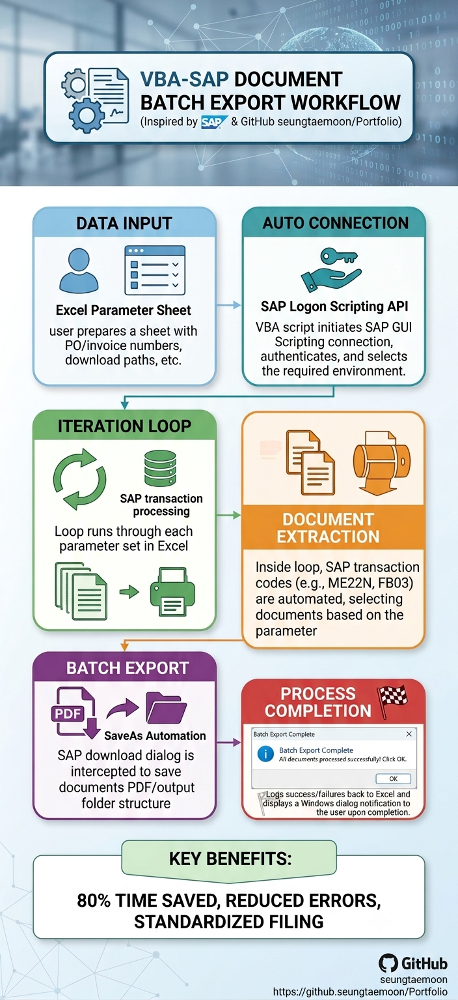

# Excel SAP Document Batch Export (VBA)

This project is an **Excel VBA automation** that connects to **SAP GUI** and **batch‑exports document‑type PDFs** (e.g., inspection or quality documents) from SAP into a local folder, while updating status and document IDs back in Excel.[web:177][web:179]

The macro reads a list of materials from an Excel column, opens the relevant SAP document view, double‑clicks rows to activate links, prints the document to a PDF printer, and uses Windows API calls (`FindWindow`, `SetForegroundWindow`) to automatically fill the “Save As PDF” dialog. This turns a **manual, repetitive SAP PDF‑export process** into a one‑click Excel macro.[web:14][web:17]

---

## Key Features

- **Batch processing** of material numbers from an Excel worksheet, with column‑based status tracking.
- **SAP GUI Scripting** via Excel VBA to:
  - Enter material codes.
  - Navigate grids and tabs.
  - Print documents to a virtual PDF printer.
- **Windows API automation** of the “Save As PDF” dialog to type the path and press Enter.
- **Reusable, modular VBA**:
  - `modMain_ExcelSAP_BatchPDF.bas` – main loop and Excel integration.
  - `modWinAPI_DialogHelpers.bas` – Win32 API and file helpers.
  - `modSAP_Helpers.bas` – all SAP‑specific logic.
  - `modCore_Workflow.bas` – core business workflow (material handling and document finding).

All sensitive internal strings (paths, SAP IDs, company terms) have been replaced with generic placeholders so this can be safely shared as a portfolio project.[web:180]

---

## Workflow Overview

The image below summarizes the end-to-end workflow of the project: Excel is used as the input layer, SAP GUI scripting performs the automated transaction steps, documents are extracted in a controlled batch loop, and the output is saved into a standardized folder structure. The process then reports completion back to the user through Excel and a final dialog notification.

This diagram is included as a conceptual portfolio visual. It communicates the structure of the solution without revealing real SAP data or internal company details, and it reflects the iterative, AI-assisted development approach used to refine the project.

***Image created in assistance of Gemini**



---

## Project Structure

Suggested module layout:

- `modMain_ExcelSAP_BatchPDF.bas`  
  - Main entry point and Excel‑loop logic.
- `modWinAPI_DialogHelpers.bas`  
  - Win32 API declarations and `AutomateSaveAsDialog`.
- `modSAP_Helpers.bas`  
  - SAP session, grid navigation, print button handling.
- `modCore_Workflow.bas`  
  - Core workflow: `HandleMaterialWithoutFile`, text cleaning, status handling.

This separation keeps the code **clean, testable, and reusable**.

---

## Requirements

- **Environment**
  - Windows with **SAP GUI** installed and **SAP GUI Scripting enabled** (server + client).
  - **Excel** (tested 64‑bit; uses `PtrSafe` declarations).
  - A **PDF‑capable printer** or virtual PDF printer (e.g., “Virtual PDF Printer”).

- **Excel Setup**
  - Create a **macro‑enabled workbook** (`.xlsm`).  
  - Import the four `.bas` modules and run `CreateFilesInGroupFolders_Document_Batch_PDF` from `modMain_ExcelSAP_BatchPDF`.  
  - Column `B` used for material numbers, column `C` for file status, column `D` for document ID.

- **SAP Setup**
  - SAP GUI Scripting must be enabled in SAP and in the user profile (registry or SAP options).  
  - Customize the SAP control IDs (`SAP_MATERIAL_FIELD_ID`, `SAP_GRID_ID`, etc.) to match your transaction of choice.

---

## Installation

1. Clone this repository:
   ```bash
   git clone https://github.com/YOUR_USERNAME/vba-sap-document-batch-export.git
   ```
2. Open your target Excel workbook and press `ALT + F11` to open the VBA editor.  
3. Import the four `.bas` files:
   - `File` → `Import File...` → select `modMain_ExcelSAP_BatchPDF.bas`, `modWinAPI_DialogHelpers.bas`, `modSAP_Helpers.bas`, `modCore_Workflow.bas`.  
4. Save the workbook as a **macro‑enabled file** (`.xlsm`).  
5. Adjust constants in `modWinAPI_DialogHelpers` and `modSAP_Helpers` to match your environment (folder path, SAP element IDs, printer name, dialog captions).  
6. Run the macro:
   - `Developer` → `Macros` → select `CreateFilesInGroupFolders_Document_BatchPDF` or assign it to a button.

---

## Usage

1. Prepare an Excel sheet:
   - Column `B`: list of material numbers (or document keys).  
   - Column `C`: leave blank or `N` for rows to be processed.  
   - Column `D`: receives the document ID from SAP.
2. Ensure SAP GUI is open and logged in.  
3. Run `CreateFilesInGroupFolders_Document_BatchPDF`.  
4. Monitor the **Immediate Window** (`CTRL + G` in VBA) for debug messages.  
5. After completion:
   - Check that PDFs were created under the configured folder (e.g., `C:\Users\Developer\Documents\Document_Batch_Output\`).  
   - Check that columns `C` and `D` are updated with status and document IDs.

---

## Security and Disclosure Note

- All company‑specific strings (paths, transaction IDs, project names) have been **replaced with generic placeholders**.  
- This is a **portfolio‑oriented project** to demonstrate Excel VBA, SAP GUI Scripting, and Windows API automation, not production‑ready for enterprise use without review.  
- Always follow your organization’s policies for SAP GUI scripting and automation usage.[web:33][web:63]

---

## License

MIT License (or another open‑source license of your choice).  
You can copy the standard MIT text and customize your name and year, or use a GitHub license selector during repo creation.

---

## Motivation

This project is used as part of my technical portfolio to demonstrate:
- Building **non‑trivial Excel VBA automations** for repetitive enterprise workflows.
- Understanding and scripting **SAP GUI processes** using `SAP GUI Scripting`.
- Automation patterns that connect **Excel ↔ SAP ↔ Windows dialog** flows.

If you would like to feature this code in GitHub, please respect the MIT license and attribution if you extend or reuse the code in your own projects.[web:44]
